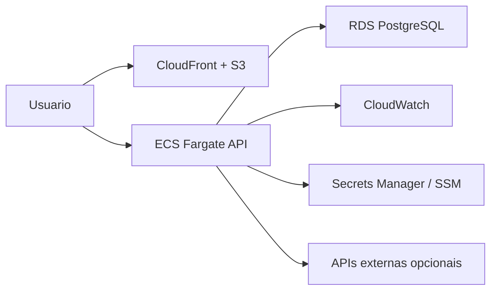

# Arquitetura

## Visao geral

CarHub Cloud utiliza um monorepo com separacao explicita entre experiencia web, API, banco e infraestrutura.

## Camadas

- `frontend`: apresentacao, estado de UI, autenticacao no cliente, navegacao e componentes reutilizaveis.
- `backend`: regras de dominio, seguranca, persistencia, integracoes externas e observabilidade.
- `infra`: provisionamento AWS com Terraform.
- `docs`: guias tecnicos e visao arquitetural.

## Decisoes tecnicas

- Express foi escolhido para acelerar a implementacao mantendo modularidade clara.
- Prisma centraliza o acesso ao banco e facilita seeds, filtros e consistencia de tipos.
- React + Vite entregam experiencia rapida e ergonomia excelente para um dashboard rico.
- Terraform deixa o deploy reproducivel e auditavel.

